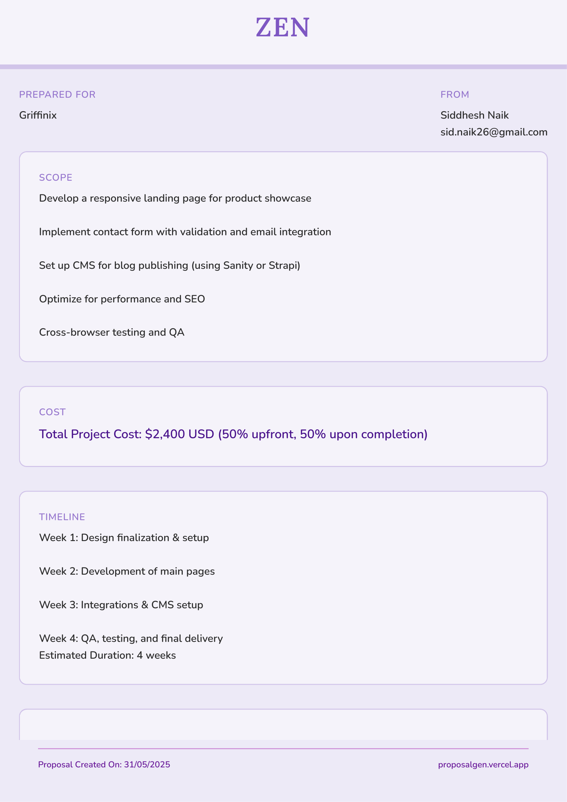
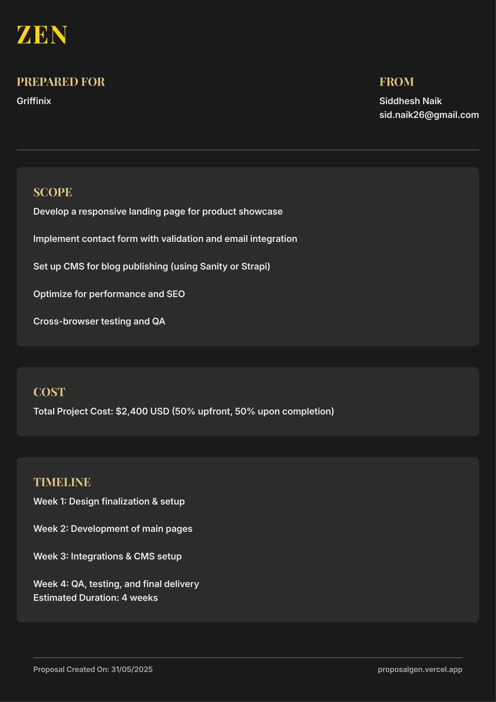
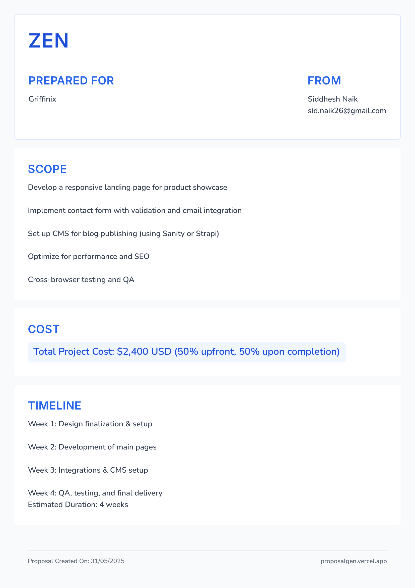

<p align="center">
  
</p>

# 📑 ProposalGen

**ProposalGen** is a sleek, modern proposal generator for freelancers, agencies, and consultants. Create elegant, branded PDF proposals in seconds — no design or formatting required.

Built with a focus on theming, automation, and pixel-perfect PDF output, ProposalGen helps you pitch like a pro.

---

## ✨ Features

-   🎨 **Beautiful Themes**  
    Choose from professional templates like **Modern**, **Elegant**, and **Soft Aurora** with live previews.

-   📝 **Dynamic Proposal Builder**  
    Easily input your **scope**, **timeline**, **pricing**, and **terms** — real-time updates and export-ready.

-   ⚡ **Live PDF Preview**  
    Instantly preview your proposal using server-rendered PDFs powered by `@react-pdf/renderer`.

-   📄 **Pixel-Perfect PDF Export**  
    Generate clean, print-friendly proposals tailored for clients.

-   🧠 **Smart Font & Style System**  
    Use templates with elegant fonts like **Lora**, **Nunito**, and **Inter** with ease.

---

## 🖼️ Screenshots

### 🧩 Web UI


---

### 🎨 Theme: Soft Abstract



---

### 🌙 Theme: Dark Elegant



---

### 💼 Theme: Modern Minimal



---

## 🛠️ Tech Stack

-   **Framework**: [Next.js](https://nextjs.org/) (App Router)
-   **Styling**: TailwindCSS
-   **PDF Engine**: `@react-pdf/renderer` (WASM-safe)
-   **Font Management**: Local font registration (`Lora`, `Inter`, `Nunito`, `Playfair`)
-   **Rendering Preview**: `BlobProvider` + iframe for safe hydration

---

## 🚀 Getting Started

```bash
git clone https://github.com/sidchigo/proposalgen.git
cd proposalgen
npm install
npm run dev
```
